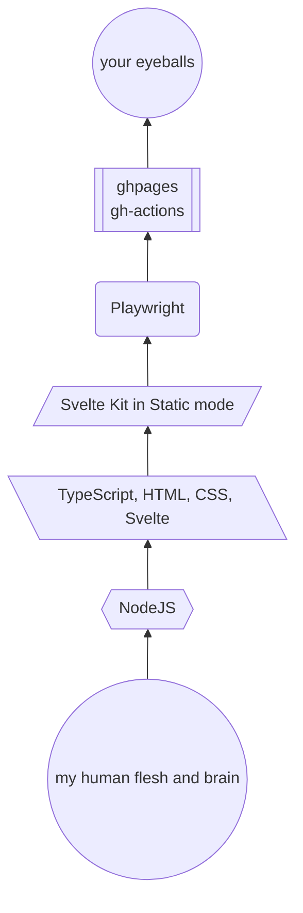

## alexander-jeff.github.io

Github.io static site

## Here's the stack

Static site made with Svelte Kit!

TDD courtesy of Playwright.

```mermaid
graph BT
    y((your eyeballs))
    g[[ghpages</br>gh-actions]]
    i(Playwright)
    a[/Svelte Kit in Static mode/]
    b[\TypeScript, HTML, CSS, Svelte\]
    c{{NodeJS}}
    d((my human flesh and brain))
    d --> c --> b --> a --> i --> g -->y
```
